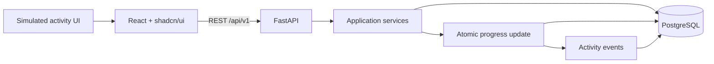

# StudyCircle Demo Implementation Roadmap

## 1. Purpose

This directory turns [`v1-overview.md`](../v1-overview.md) into a phased implementation plan for a persistent, testable demo of the StudyCircle community layer inside Shikho.

The demo proves this loop:

1. Create a lightweight demo identity.
2. Join the recommended circle.
3. View shared missions, quests, roadmap positions, activity, and ranking.
4. Complete a simulated activity and see all community progress update.
5. Share and react to notes.
6. Become the weekly Mentor and publish the next roadmap.

Lessons, quizzes, and content delivery are deliberately represented by short simulations. They are inputs into the community system, not products to implement.

## 2. Source and product context

The source of truth is [`v1-overview.md`](../v1-overview.md). Shikho's public site was reviewed only to keep terminology and visual context recognizable:

- [Shikho home](https://shikho.com/) presents an academic and admission-preparation platform for class-based learning.
- Its public feature list includes live and recorded classes, animated videos, MCQ tests, class notes, smart notes, and report cards.
- [The Class 10 academic page](https://shikho.com/academic-program/academic-program-class-10) groups content by subjects including Mathematics.
- [About Shikho](https://shikho.com/about-us) reinforces a Bangla-first, accessible digital-learning identity.

These observations inform labels, seed data, and visual tone. They do not expand the demo into a course platform.

## 3. Scope decisions

### In scope

- One seeded Class 10 Mathematics circle.
- One active monthly mission, daily quest, and weekly roadmap.
- Demo identity creation and username-plus-key return login.
- Circle membership and a community dashboard.
- Simulated lesson, quiz, review, and challenge completion.
- Roadmap position, mission, quest, streak, leaderboard, and activity-feed updates.
- Text or small image notes, chapter/category filters, and helpful reactions.
- Deterministic Mentor selection, roadmap composition, publishing, and demo week rollover.
- PostgreSQL persistence across browser refresh and backend restart.

### Explicitly out of scope

- Production authentication, authorization, account recovery, OTP, OAuth, or password reset.
- Real Shikho accounts, subscriptions, lessons, quizzes, reports, or content APIs.
- Multiple circles, automatic matching, teachers, parents, administrators, or moderation queues.
- Chat, comments, direct messages, notifications, or real-time sockets.
- Background schedulers, calendar-driven resets, analytics, or production operations.
- Rich note editing, video/audio uploads, file scanning, or object storage.

## 4. Technical baseline

| Layer | Choice | Notes |
| --- | --- | --- |
| Frontend | React + TypeScript + Vite | React Router for screens and TanStack Query for server state. |
| UI | Tailwind CSS + shadcn/ui primitives | Compose product-specific components from primitives; do not add a second component library. |
| Backend | FastAPI | Pydantic request/response models and REST endpoints under `/api/v1`. |
| Data | PostgreSQL | SQLAlchemy 2.x and Alembic migrations. |
| Backend tests | pytest + HTTPX | Include PostgreSQL-backed integration tests for transactions and constraints. |
| Frontend tests | Vitest + React Testing Library | Test forms, route guards, state transitions, and error states. |
| End-to-end tests | Playwright | One cumulative reviewer journey against the real API and test database. |
| Local runtime | Docker Compose | PostgreSQL plus documented frontend/backend commands. |

Recommended repository layout:

```text
backend/
  app/
    api/
    core/
    db/
    models/
    schemas/
    services/
  migrations/
  tests/
frontend/
  src/
    components/
    features/
    lib/
    pages/
    routes/
  tests/
docs/
  implementation/
```

## 5. Architecture



The backend owns all score and progress calculations. The frontend never calculates authoritative points, ranks, streaks, or mission totals.

## 6. Demo access model

On first use, a student provides:

- unique username;
- display name;
- class level;
- curriculum/board;
- preferred subject;
- optional school name.

The demo supports only the seeded Class 10 Mathematics experience, so class and subject are preselected and clearly labelled as the available demo cohort. The backend generates a readable access key such as `SC-A7K9-M2QX`. Return visits use username plus access key.

The client stores these two values in `localStorage` and sends them as `X-Demo-Username` and `X-Demo-Access-Key`. The backend verifies them on every protected request. There are no passwords, JWTs, cookies, expiry, rotation, or recovery.

This is intentionally insecure and must display a `Demo access only` notice. Do not reuse the design in production or use a real password as the key. The key may be stored as plain text for this disposable demo database.

## 7. Brand and interface rules

Define semantic CSS variables and map shadcn/ui tokens to them:

| Token | Value | Intended use |
| --- | --- | --- |
| `--brand-dark-blue` | `#2D4797` | Navigation, headings, primary dark surfaces. |
| `--brand-blue` | `#355DAB` | Primary actions, links, active states. |
| `--brand-pink` | `#E2008D` | Community highlights and progress accents. |
| `--brand-magenta` | `#E40289` | Mentor/high-emphasis accent; visually near the pink token. |
| `--brand-yellow` | `#FAA700` | Streaks, rank, celebration, warning accents. |
| `--surface` | `#FFFFFF` | Cards and page surfaces. |
| `--text` | `#000000` | Primary text where full black is appropriate. |

The supplied list called `#000000` “white.” Because `#000000` is black, this plan uses `#FFFFFF` for white and retains `#000000` as a text color. This is an explicit demo implementation decision.

Use shadcn/ui `Button`, `Card`, `Badge`, `Avatar`, `Progress`, `Tabs`, `Dialog`, `Sheet`, `Form`, `Input`, `Select`, `Textarea`, `Table`, `Alert`, `Skeleton`, `Toast`, and `DropdownMenu` where applicable. A roadmap track and rank podium are product-specific components built using ordinary React and CSS.

The public Shikho experience is Bangla-first. The initial demo can use concise English copy from the overview, but layouts must tolerate Bangla strings and use a font stack with Bangla glyph coverage. Do not build localization infrastructure in V1.

## 8. API and data conventions

- All application endpoints use `/api/v1`; process health endpoints remain under `/health`.
- UUID primary keys are generated by the backend.
- Timestamps are stored in UTC and returned as ISO 8601 strings.
- The configured display timezone is `Asia/Dhaka` for day/week labels.
- Mutations return the updated resource or a compact aggregate needed to refresh the UI.
- Errors use one shape: `{ "code": "machine_code", "message": "Human-readable message", "fields": {} }`.
- Database constraints enforce uniqueness and valid progress ranges.
- Completion, reaction, join, publish, and rollover commands are idempotent or reject duplicates predictably.
- Multi-aggregate progress updates run in one PostgreSQL transaction.
- Pagination is unnecessary for the seeded demo; feed and notes endpoints accept a small `limit` with a hard maximum of 50.

## 9. Core data model by phase

| Entity | Introduced | Responsibility |
| --- | --- | --- |
| `demo_users` | Phase 0 | Demo metadata and access key. |
| `circles`, `circle_memberships` | Phase 1 | Single cohort and membership. |
| `missions`, `daily_quests` | Phase 1 | Shared progress aggregates. |
| `weekly_cycles`, `roadmaps`, `roadmap_checkpoints` | Phase 1 | Active week and ordered community plan. |
| `activity_completions` | Phase 2 | Idempotent record of simulated work. |
| `activity_events` | Phase 2 | Server-generated feed events. |
| `notes`, `note_reactions` | Phase 3 | Shared resources and unique helpful reactions. |
| `mentor_terms` | Phase 4 | Auditable weekly Mentor assignment. |

## 10. Phase sequence

| Phase | Deliverable | Independent exit test |
| --- | --- | --- |
| [0](phase-0-foundation-and-demo-access.md) | Stack, schema baseline, seeded database, demo identity, return login | Create a student, copy the key, clear browser storage, and log back in. |
| [1](phase-1-circle-entry-and-dashboard.md) | Product onboarding, join, persistent read-only Circle Home | Join once, refresh, and remain on a populated dashboard. |
| [2](phase-2-simulated-progress-and-leaderboard.md) | Roadmap activity simulation and atomic community progress | Complete one checkpoint and verify roadmap, points, quest, mission, rank, and feed. |
| [3](phase-3-circle-store.md) | Notes, image note, filters, and helpful reaction | Add and react to a note, then refresh and verify persistence. |
| [4](phase-4-mentor-and-roadmap-publishing.md) | Mentor selection, next roadmap builder, publish, week rollover | Crown the leader, publish a reordered roadmap, start the next week, and verify it. |
| [5](phase-5-demo-hardening-and-acceptance.md) | Resettable seed, responsive polish, full E2E acceptance | Run the complete reviewer journey twice from a clean reset. |

Each phase includes migrations, backend behavior, frontend behavior, automated tests, and a manual test gate. A phase is complete only when its gate passes; later-phase UI placeholders must not pretend unfinished behavior works.

## 11. Requirement coverage

| Overview requirements | Owning phase |
| --- | --- |
| FR-01 open StudyCircle; FR-02 onboarding; FR-03 membership persistence | Phase 1, using Phase 0 identity access |
| FR-04 Circle Home; FR-05 mission; FR-06 quest | Phase 1 display, Phase 2 updates |
| FR-07 simulated activity; FR-08 roadmap; FR-09 roadmap movement | Phase 2 |
| FR-10 leaderboard; FR-11 leaderboard update | Phase 2 |
| FR-12 Mentor assignment; FR-13 Mentor Workspace; FR-14 create roadmap; FR-15 publish persistence | Phase 4 |
| FR-16 Store; FR-17 add note; FR-18 helpful reaction | Phase 3 |
| FR-19 Circle Streak | Phase 1 display, Phase 2 update |
| FR-20 activity events | Phase 2 base events, Phases 3–4 feature events |
| FR-21 persistent demo state | Built incrementally in Phases 0–4 and verified cumulatively in Phase 5 |

## 12. Cross-phase quality bar

- Loading, empty, error, and success states exist for every server-backed screen.
- Keyboard focus is visible and dialogs/forms have labels and usable focus management.
- Color is never the only indication of rank, progress, locked state, or success.
- Mobile layout works at 360 px; desktop layout is verified at 1280 px.
- No mutation depends on a page reload to appear successful.
- A refresh after every acceptance action returns the same persisted state.
- Seed and reset commands make test runs deterministic.
- The repository contains `.env.example` files and no committed credentials.

## 13. Definition of done

V1 is complete when all six phase gates pass and the Phase 5 Playwright journey covers the 19 acceptance outcomes in the overview without using real course content, real authentication, real-time infrastructure, or manual database edits.
