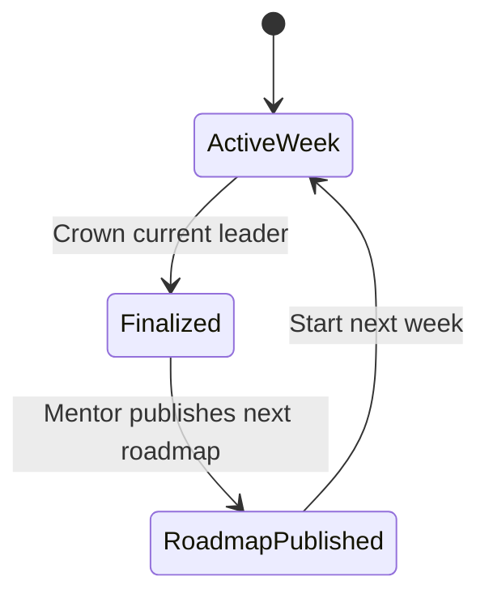

# Phase 4 — Mentor and Roadmap Publishing

## Outcome

The current leaderboard leader can be crowned Mentor through an explicit demo control, use a constrained workspace to compose and reorder next week's roadmap, select a Mentor's Pick note, publish, and start the next week without a background job.

## Dependencies

- Phase 2 leaderboard and active weekly cycle.
- Phase 3 notes for Mentor's Pick.

## In scope

- Manual demo week finalization.
- Mentor term and access-gated workspace.
- Predefined topics and activity types.
- Roadmap title, selection, ordering, preview, Mentor's Pick, and publish.
- Manual next-week start and leaderboard reset.
- Mentor, publish, and rollover feed events.

## Not in scope

- Calendar scheduler, cron, automatic week boundaries, notifications, approvals, collaborative authoring, freeform lesson creation, or historical analytics.
- Production-grade authorization. The same demo header model is used, with server-side role checks.

## State machine



- Only one cycle is `active` or `finalized` for a circle.
- Finalizing an already finalized cycle returns its existing Mentor term.
- Publishing is allowed only to that cycle's Mentor and only once for the next cycle.
- Starting next week requires a published next roadmap.

## Mentor selection rules

1. Rank members using the Phase 2 deterministic ordering.
2. Create one `mentor_terms` row for the finalized cycle and winner.
3. Update `circle_state.current_mentor_user_id`.
4. Create `mentor_selected` event.
5. Do not reset points yet; the final ranking remains visible until next-week start.

The demo button should be labelled `Demo control: Crown current leader`. Put it in an overflow/demo-controls panel so it is clear this is not normal student functionality.

## Roadmap builder rules

- Title: 5–80 characters.
- Exactly 3–5 checkpoints.
- Topic comes from predefined Class 10 Mathematics choices such as Algebra Basics, Linear Equations, Geometry, Trigonometry, and Revision.
- Activity type comes from `review`, `lesson`, `quiz`, or `challenge`.
- Checkpoint display title is selected from predefined topic/activity combinations or generated by the server from those values.
- Reorder with visible `Move up` and `Move down` buttons. Drag-and-drop is optional and cannot replace keyboard controls.
- Select exactly one existing note as Mentor's Pick.
- Preview uses the same `RoadmapTrack` component as the student view.

## Frontend implementation

### Routes

| Route | Purpose |
| --- | --- |
| `/app/study-circle/:circleId/mentor` | Mentor workspace and roadmap builder. |
| `/app/study-circle/:circleId/mentor/preview` | Optional full preview before publish. |

### Components

- `DemoWeekControls`: finalize and start-next-week actions with confirmation dialogs.
- `MentorGate`: server-backed access denied/loading/allowed states.
- `RoadmapBuilderForm`: title, topic/activity selections, 3–5 checkpoint list.
- `CheckpointOrderControls`: accessible up/down controls and position labels.
- `MentorPickSelect`: note cards or select with title, author, category, and helpful count.
- `PublishSummary`: published title, checkpoints, pick, and next action.

Do not hide unauthorized API errors behind client routing. The backend remains authoritative.

## Backend data model

### `mentor_terms`

| Column | Type | Rules |
| --- | --- | --- |
| `id` | UUID | Primary key. |
| `circle_id` | UUID | Required. |
| `weekly_cycle_id` | UUID | Required and unique. |
| `mentor_user_id` | UUID | Required. |
| `final_rank` | integer | Must be 1. |
| `final_points` | integer | Snapshot. |
| `selected_at` | timestamptz | Required. |

Extend roadmap storage with `mentor_pick_note_id` and a way to associate a `published` roadmap with the next weekly cycle. Prefer creating the next cycle in `planned` state at publish time, then activating it during rollover.

## API

### `POST /api/v1/demo/circles/{circle_id}/finalize-week`

Demo-only command. Lock the active cycle and ranking rows, select the leader, create or return the Mentor term, set cycle to `finalized`, and create one event atomically.

### `GET /api/v1/circles/{circle_id}/mentor-workspace`

Only the current Mentor may access it. Returns current term, allowed topics/activity types, eligible notes, any planned roadmap, and builder constraints.

### `POST /api/v1/circles/{circle_id}/next-roadmap`

Request:

```json
{
  "title": "Algebra Momentum Week",
  "mentor_pick_note_id": "uuid",
  "checkpoints": [
    { "topic_key": "algebra_basics", "activity_type": "review" },
    { "topic_key": "linear_equations", "activity_type": "lesson" },
    { "topic_key": "linear_equations", "activity_type": "quiz" }
  ]
}
```

Validate Mentor ownership, order, count, predefined combinations, and note membership in the circle. Create the planned cycle/roadmap/checkpoints and `roadmap_published` event in one transaction. Accept an `Idempotency-Key` to prevent duplicate publish.

### `POST /api/v1/demo/circles/{circle_id}/start-next-week`

Lock current/planned cycles and memberships. Require finalized current cycle and published planned roadmap, then:

1. archive the finalized cycle;
2. activate the planned cycle and roadmap;
3. reset every membership's weekly points and roadmap position to zero;
4. retain lifetime note data and contribution history;
5. create the new daily quest for the Dhaka-local date if absent;
6. retain the selected Mentor as the displayed Mentor for the new term;
7. create one `week_started` event.

This endpoint is idempotent and returns the already-active new cycle if called again with the same finalized predecessor.

## Implementation order

1. Add Mentor term and planned-cycle migrations/constraints.
2. Implement finalization service with locking and idempotency tests.
3. Implement Mentor workspace query and server-side gate.
4. Build the constrained roadmap form, order controls, note selection, and preview.
5. Implement publish transaction and event.
6. Implement next-week activation/reset transaction.
7. Refresh dashboard, roadmap, leaderboard, Store highlight, and feed after each command.

## Automated tests

### Backend

- Crowns the deterministic rank-one member and only once.
- Rejects finalization with no active cycle or no members.
- Rejects non-Mentor workspace and publish requests.
- Rejects too few/many checkpoints, unknown options, invalid note, duplicate publish, and malformed order.
- Publishes roadmap, checkpoint order, Mentor's Pick, and event atomically.
- Rolls over once, resets every member, activates the published roadmap, and preserves notes.
- Rolls back the entire reset if any membership update fails.

### Frontend

- Shows demo-control wording and destructive-action confirmation.
- Reveals workspace only after server confirms Mentor access.
- Enforces 3–5 checkpoint UI constraints and title validation.
- Reorders by keyboard-operable controls and announces positions.
- Shows Mentor's Pick in Store and published roadmap on Circle Home.
- Shows zeroed leaderboard and positions after rollover.

## Manual test gate

1. Use simulated activities until the demo student is visibly rank one.
2. Select `Demo control: Crown current leader` and verify the Mentor badge and feed event.
3. Open the Mentor workspace.
4. Choose 3–5 predefined checkpoints, reorder them, and select a note.
5. Publish and verify the roadmap preview and Mentor's Pick.
6. Select `Start next week` and verify the published roadmap is active, ranks/positions are zero, and notes remain.
7. Refresh and repeat both demo commands; confirm neither duplicates data.

## Exit criteria

- Mentor selection, publish, and rollover are transactionally safe and idempotent.
- Only the current Mentor can publish.
- The feature remains constrained to predefined demo content and manual controls.
